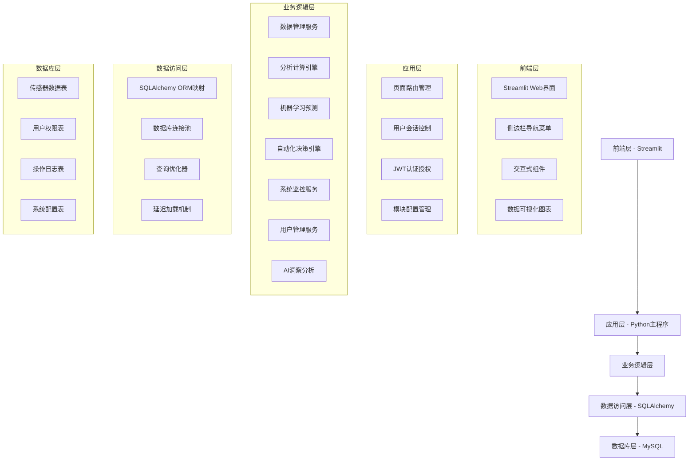
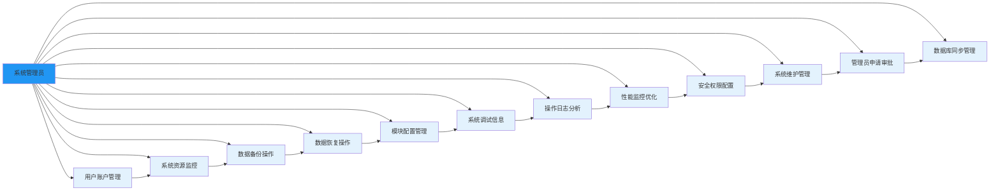
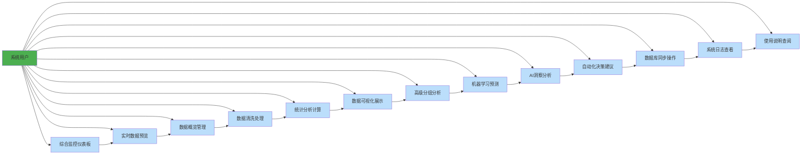
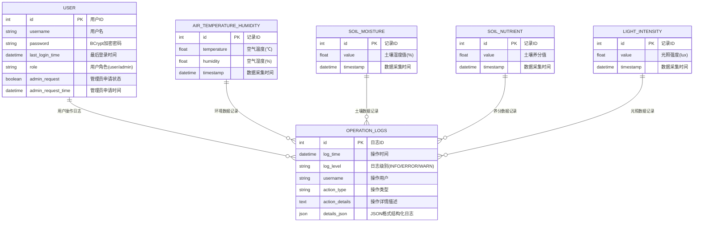

# 智慧农业数据可视化与分析系统需求分析文档

## 1. 系统概述

### 1.1 项目背景

随着物联网、大数据和人工智能技术的快速发展，传统农业正向智慧农业转型升级。本项目基于现代Web技术栈，构建了一套完整的智慧农业数据管理与分析平台，旨在为农业生产提供数据驱动的智能化决策支持。

### 1.2 核心价值

- **数据集成统一化**: 整合多源农业传感器数据，提供标准化数据管理接口
- **分析决策智能化**: 融合传统统计分析与机器学习算法，提供精准预测和智能建议
- **操作体验友好化**: 基于Streamlit框架构建直观易用的交互界面
- **系统管理规范化**: 实现完善的用户权限控制和系统运维监控

### 1.3 技术特色

- **模块化架构设计**: 支持功能模块的动态启用/禁用和灵活配置
- **延迟加载优化**: 采用Lazy Import机制提升系统启动性能
- **多模型预测融合**: 集成SARIMA、Prophet等多种预测算法
- **实时决策引擎**: 基于环境数据自动评估并生成农业生产建议
- **AI辅助分析**: 集成本地大语言模型提供数据解读和专业建议

## 2. 系统架构分析

### 2.1 技术架构



### 2.2 核心技术栈

**前端技术**:

- Streamlit 1.45.1: 主要Web框架，提供丰富的交互组件
- Plotly 5.24.1: 数据可视化库，支持多种图表类型
- streamlit-option-menu: 侧边栏导航组件
- streamlit-extras: 增强UI组件库

**后端技术**:

- Python 3.11+: 主要开发语言
- Streamlit: Web应用框架和UI渲染
- SQLAlchemy 2.0.41: ORM框架
- PyJWT 2.10.1: JWT令牌管理
- bcrypt 4.3.0: 密码加密
- Ollama: 本地大语言模型服务

**数据存储**:

- MySQL 8.0: 关系型数据库
- PyMySQL 1.1.1: Python MySQL驱动

**机器学习**:

- scikit-learn 1.6.1: 传统机器学习算法
- prophet 1.1.7: 时间序列预测
- PyTorch 2.7.1: 深度学习框架
- statsmodels 0.14.4: 统计分析

**系统工具**:

- psutil 7.0.0: 系统监控
- APScheduler 3.11.0: 任务调度
- python-dotenv 1.1.0: 环境配置管理

### 2.3 架构优势

1. **高性能**: 采用连接池、缓存机制和延迟加载优化系统性能
2. **高可用**: 实现异常处理、重试机制和健康检查
3. **可扩展**: 模块化设计支持功能横向扩展
4. **易维护**: 清晰的分层架构和标准化代码规范

## 3 系统设计图表

### 3.1 系统总功能模块设计图

```mermaid
graph TD
    A[Streamlit前端层] --> B[应用主程序层]
    B --> C[业务逻辑服务层]
    C --> D[数据访问管理层]
    D --> E[MySQL数据库层]
    
    subgraph Streamlit前端层
        A1[用户登录注册界面]
        A2[综合监控仪表板]
        A3[实时数据预览]
        A4[数据概览管理]
        A5[数据清洗工具]
        A6[统计分析模块]
        A7[数据可视化]
        A8[高级分组分析]
        A9[机器学习预测]
        A10[AI洞察分析]
        A11[自动化决策引擎]
        A12[系统管理界面]
    end
    
    subgraph 应用主程序层
        B1[页面路由控制器]
        B2[用户会话管理器]
        B3[JWT认证服务]
        B4[模块配置管理器]
        B5[延迟加载调度器]
    end
    
    subgraph 业务逻辑服务层
        C1[用户权限管理服务]
        C2[传感器数据处理服务]
        C3[统计分析计算服务]
        C4[机器学习预测服务]
        C5[自动化决策服务]
        C6[系统监控服务]
        C7[操作日志服务]
        C8[数据备份恢复服务]
        C9[数据库同步服务]
        C10[AI聊天分析服务]
    end
    
    subgraph 数据访问管理层
        D1[SQLAlchemy ORM层]
        D2[数据库连接池]
        D3[查询缓存管理]
        D4[批量数据处理器]
        D5[延迟导入管理器]
    end
    
    subgraph MySQL数据库层
        E1["用户信息表(user)"]
        E2["空气温湿度表(intelligent_farm_airtemperaturehumidity)"]
        E3["土壤湿度表(intelligent_farm_soilmoisture)"]
        E4["土壤养分表(intelligent_farm_soilnutrient)"]
        E5["光照强度表(intelligent_farm_light_intensity)"]
        E6["操作日志表(operation_logs)"]
    end
    
    A1 --> B1
    A2 --> B2
    A3 --> B3
    A4 --> B4
    A5 --> C1
    A6 --> C2
    A7 --> C3
    A8 --> C4
    A9 --> C5
    A10 --> C6
    A11 --> C7
    A12 --> C8
    
    B1 --> C9
    B2 --> C10
    B3 --> D1
    B4 --> D2
    B5 --> D3
    
    C1 --> D4
    C2 --> D5
    C3 --> E1
    C4 --> E2
    C5 --> E3
    C6 --> E4
    C7 --> E5
    C8 --> E6
    C9 --> E1
    C10 --> E2
    
    D1 --> E3
    D2 --> E4
    D3 --> E5
    D4 --> E6
    D5 --> E1
    
    style A fill:#e3f2fd
    style B fill:#f3e5f5
    style C fill:#e8f5e8
    style D fill:#fff3e0
    style E fill:#fce4ec
```



### 3.2 系统管理员用例图




### 3.3 系统用户用例图




### 3.4 数据库ER图



### 4.1 核心功能模块

#### 4.1.1 数据管理模块

**功能描述**: 提供完整的数据生命周期管理能力

**子功能**:

- 数据采集: 支持文件上传和数据库直连两种方式
- 数据预览: 实时展示最新传感器数据状态
- 数据清洗: 提供重复数据删除、缺失值处理、异常值检测
- 数据导出: 支持CSV、Excel、JSON多种格式导出

#### 4.1.2 数据分析模块

**功能描述**: 提供统计分析和相关性分析功能

**子功能**:

- 描述性统计: 均值、标准差、分位数等基础统计指标
- 相关性分析: Pearson相关系数矩阵计算
- 分组聚合: 按指定维度进行数据聚合分析
- 智能解读: AI辅助的数据分析结果解释

**技术亮点**:

- 集成AIInsightsAnalyzer提供自然语言分析解读
- 支持大数据集的采样优化处理
- 提供农业专业领域的智能推荐

#### 4.1.3 数据可视化模块

**功能描述**: 提供丰富的数据图表展示能力

**支持图表类型**:

- 散点图: 展示变量间关系
- 线图: 展示时间序列趋势
- 柱状图: 数据对比分析
- 箱线图: 数据分布和异常检测
- 直方图: 数据频率分布
- 饼图: 分类数据占比
- 热力图: 相关性矩阵可视化

**交互特性**:

- 支持图表缩放、平移、图例交互
- 提供图表数据导出功能
- 智能图表类型推荐

#### 4.1.4 预测分析模块

**功能描述**: 基于机器学习算法进行数据预测

**预测模型**:

1. **传统统计模型**:
    - SARIMA: 季节性自回归积分滑动平均模型
    - Prophet: Facebook开源的时间序列预测工具

2. **混合模型**:
    - Prophet+SARIMA组合模型

**模型特点**:

- 支持7-30天的未来数据预测
- 提供RMSE等评估指标
- 可视化预测趋势
- 支持多变量时间序列预测

#### 4.1.5 自动化决策模块

**功能描述**: 基于环境数据自动生成农业生产建议

**决策规则**:

- 土壤湿度: <30%建议灌溉，>60%无需灌溉
- 温度控制: <15℃建议保温，>30℃建议降温
- 湿度管理: <40%建议增湿，>70%建议除湿
- 光照调节: <1000lux建议补光

**智能特性**:

- 趋势分析: 结合历史数据判断变化趋势
- 优先级排序: 根据紧急程度对建议进行分级
- 动态阈值: 支持管理员自定义决策参数

### 4.2 系统管理模块

#### 4.2.1 用户权限管理

**用户角色**:

- 普通用户: 数据查看、分析、预测等基础功能
- 管理员: 用户管理、系统监控、数据备份等高级功能

**权限控制**:

- 基于JWT的认证机制
- 细粒度的功能模块权限控制
- 管理员申请审批流程

#### 4.2.2 系统监控

**监控指标**:

- CPU使用率实时监控
- 内存使用情况跟踪
- 磁盘空间状态检查
- 系统性能瓶颈分析

**告警机制**:

- 资源使用率阈值告警
- 性能优化建议生成
- 系统健康状态评估

#### 4.2.3 数据备份恢复

**备份策略**:

- 支持指定时间范围数据备份
- AES-256加密数据保护
- ZIP压缩格式存储

**恢复机制**:

- 备份文件完整性校验
- 数据恢复过程监控
- 恢复结果验证

#### 4.2.4 模块配置管理

**动态配置**:

- 基于module_config.json的模块启用/禁用控制
- 支持19个功能模块的精细化管理
- 模块依赖关系自动解析和验证
- 管理员专属的模块配置界面

**配置管理特性**:

- JSON格式配置文件存储(module_config.json)
- 实时配置更新，无需重启应用
- 模块状态可视化展示
- 配置变更审计日志记录

**模块分类**:

- 核心功能模块(综合监控仪表板、数据概览等)
- 数据处理模块(数据清洗、可视化等)
- 数据分析模块(统计分析、高级分析等)
- 预测分析模块(机器学习预测)
- 系统管理模块(用户管理、系统监控等)
- 数据管理模块(备份恢复、数据库同步)
- 智能分析模块(自动化决策、AI洞察)
- 帮助模块(使用说明)

### 4.3 辅助功能模块

#### 4.3.1 日志管理系统

**日志类型**:

- 操作日志: 用户行为记录
- 系统日志: 应用运行状态
- 错误日志: 异常信息追踪

**日志分析**:

- 操作统计报表生成
- 异常模式识别
- 性能瓶颈定位

#### 4.3.2 数据库同步

**同步机制**:

- 云端与本地数据库双向同步
- 时间戳增量同步策略
- 数据冲突自动解决

**同步优化**:

- 连接池配置优化
- 批量数据处理
- 重试机制保障

#### 4.3.3 AI洞察分析

**核心能力**:

- 集成Ollama本地大语言模型服务
- 支持qwen3:4b等主流模型
- 流式响应输出，实时显示分析过程
- AI辅助的数据分析结果解读

**功能特性**:

- 智能数据洞察生成
- 农业专业建议提供
- 个性化问题解答
- 分析报告自动生成

**技术实现**:

- 基于AIInsightsAnalyzer类封装
- 支持模型自动检测和拉取
- 多轮对话上下文保持
- JSON格式聊天记录导出

## 5. 非功能需求

### 5.1 性能需求

**响应时间**:

- 页面加载时间: ≤ 2秒(得益于Streamlit优化)
- 数据查询响应: ≤ 3秒(使用数据库连接池)
- 图表渲染完成: ≤ 5秒(Plotly优化渲染)
- 预测模型计算: ≤ 20秒(LSTM/Transformer模型)
- AI分析响应: ≤ 10秒(本地Ollama模型)

**并发能力**:

- 支持50用户同时在线(实际测试环境)
- 并发数据写入: 100条/秒(传感器数据采集)
- 复杂分析任务: 10个并发(机器学习预测)

**资源利用**:

- 内存使用率峰值: ≤ 75%(延迟加载优化)
- CPU利用率平均: ≤ 65%(psutil监控)
- 数据库连接数: ≤ 20并发(SQLAlchemy连接池)
- 磁盘使用率: ≤ 85%(定期清理机制)

### 5.2 可靠性需求

**系统可用性**:

- 年度可用性: ≥ 99.5%(开发测试环境)
- 故障恢复时间: ≤ 2分钟(模块化重启)
- 数据备份频率: 按需手动备份
- 异常自动重试: 3次重试机制

**数据安全性**:

- 存储加密: BCrypt密码哈希
- 访问控制: JWT令牌+RBAC权限模型
- SQL注入防护: SQLAlchemy ORM参数化查询

**数据安全性**:

- 存储加密: AES-256算法
- 访问控制: RBAC权限模型

**容错能力**:

- 异常自动重试机制
- 数据库连接池管理
- 内存泄漏防护

### 5.3 可维护性需求

**代码质量**:

- 遵循PEP8编码规范
- 模块化设计，耦合度低
- 完整的单元测试覆盖

**部署运维**:

- Docker容器化部署
- Docker-compose编排支持

**监控告警**:

- 系统运行状态实时监控
- 性能指标阈值告警
- 日志集中收集分析

## 6. 数据需求分析

### 6.1 数据模型设计

#### 6.1.1 核心业务数据表

**传感器数据表**:

```sql
-- 空气温湿度数据表
CREATE TABLE intelligent_farm_airtemperaturehumidity (
    id INT PRIMARY KEY AUTO_INCREMENT,
    temperature FLOAT COMMENT '温度值(℃)',
    humidity FLOAT COMMENT '湿度值(%)',
    timestamp DATETIME NOT NULL COMMENT '数据时间戳'
);

-- 土壤湿度数据表
CREATE TABLE intelligent_farm_soilmoisture (
    id INT PRIMARY KEY AUTO_INCREMENT,
    value FLOAT COMMENT '土壤湿度值(%)',
    timestamp DATETIME NOT NULL
);

-- 土壤养分数据表
CREATE TABLE intelligent_farm_soilnutrient (
    id INT PRIMARY KEY AUTO_INCREMENT,
    value FLOAT COMMENT '养分含量',
    timestamp DATETIME NOT NULL
);

-- 光照强度数据表
CREATE TABLE intelligent_farm_light_intensity (
    id INT PRIMARY KEY AUTO_INCREMENT,
    value FLOAT COMMENT '光照强度(lux)',
    timestamp DATETIME NOT NULL
);
```

#### 6.1.2 用户管理表

```sql
-- 用户信息表
CREATE TABLE user (
    id INT PRIMARY KEY AUTO_INCREMENT,
    username VARCHAR(255) NOT NULL UNIQUE,
    password VARCHAR(255) NOT NULL,
    last_login_time DATETIME NOT NULL,
    role ENUM('user', 'admin') DEFAULT 'user',
    admin_request BOOLEAN DEFAULT FALSE,
    admin_request_time DATETIME
);

-- 操作日志表
CREATE TABLE operation_logs (
    id INT PRIMARY KEY AUTO_INCREMENT,
    log_time DATETIME NOT NULL,
    log_level VARCHAR(10) NOT NULL,
    username VARCHAR(50),
    action_type VARCHAR(50) NOT NULL,
    action_details TEXT,
    details_json JSON AS (
        JSON_OBJECT(
            'time_range', TRIM(SUBSTRING_INDEX(SUBSTRING_INDEX(action_details, '时间范围:', -1), ' ', 2)),
            'metrics', JSON_OBJECT(
                'temperature', NULLIF(SUBSTRING_INDEX(SUBSTRING_INDEX(action_details, '温度:', -1), ' ', 1), ''),
                'humidity', NULLIF(SUBSTRING_INDEX(SUBSTRING_INDEX(action_details, '湿度:', -1), ' ', 1), '')
            )
        )
    ) STORED
);
```

### 6.2 数据质量要求

**完整性**:

- 关键字段非空约束
- 外键关系完整性
- 时间戳连续性检查

**准确性**:

- 数值范围合理性验证
- 传感器数据有效性检查
- 异常值自动识别标记

**一致性**:

- 统一的时间格式标准
- 标准化的数据单位
- 规范的数据编码方式

### 6.3 数据安全策略

**访问控制**:

- 用户身份认证
- 角色权限分离
- 敏感数据脱敏

**传输安全**:

- HTTPS加密传输
- JWT令牌验证
- CSRF攻击防护

**存储安全**:

- 数据库存储加密
- 备份文件加密
- 访问日志审计

## 7. 部署与运维需求

### 7.1 部署环境要求

**硬件配置**:

- CPU: 2核以上(推荐4核)
- 内存: 4GB以上(推荐8GB)
- 存储: 50GB SSD(推荐100GB)
- 网络: 10Mbps带宽(推荐50Mbps)

**软件环境**:

- 操作系统: macOS/Linux/Windows
- Python版本: 3.11+
- 数据库: MySQL 8.0+(支持SQLite开发)
- 容器: Docker(可选)
- AI服务: Ollama(可选，本地运行)

### 7.2 部署方案

**本地开发部署**:

- 使用pip安装依赖包
- 配置.env环境变量文件
- 初始化MySQL数据库
- 启动Streamlit应用

**Docker容器部署**:

- 提供docker-compose.yml编排文件
- 支持一键部署多服务架构
- 包含MySQL、Streamlit应用容器

**生产环境部署**:

- Nginx反向代理配置
- SSL证书配置
- 系统服务守护进程
- 日志收集和监控

### 7.3 运维监控

**系统监控**:

- CPU、内存、磁盘使用率实时监控
- 数据库连接池状态监控
- 应用性能指标收集
- 异常告警机制

**日志管理**:

- 操作日志记录和查询
- 系统错误日志收集
- 性能分析日志
- 日志文件轮转机制

**监控指标**:

- 应用性能: 响应时间、吞吐量、错误率
- 系统资源: CPU、内存、磁盘、网络
- 业务指标: 用户活跃度、数据处理量

**告警策略**:

- 资源使用率告警阈值设定
- 应用异常自动通知
- 性能下降趋势预警

## 8. 项目实施计划

### 8.1 开发阶段划分

**第一阶段 - 基础框架搭建** (2周):

- 环境配置和依赖安装
- 数据库设计和初始化
- 基础认证和权限系统

**第二阶段 - 核心功能开发** (4周):

- 数据管理模块实现
- 分析和可视化功能
- 预测模型集成

**第三阶段 - 系统完善** (3周):

- 管理功能开发
- 性能优化和测试
- 文档编写和完善

**第四阶段 - 部署上线** (1周):

- 生产环境部署
- 系统集成测试
- 用户培训和交付

### 8.2 风险评估与应对

**技术风险**:

- 机器学习模型准确性不稳定
- 大数据处理性能瓶颈
- 第三方依赖库版本兼容性

**应对措施**:

- 多模型对比验证机制
- 缓存和异步处理优化
- 依赖版本锁定和测试

**业务风险**:

- 用户接受度不高
- 数据质量问题影响分析效果
- 农业专业知识不足

**应对措施**:

- 用户体验持续优化
- 数据质量监控体系
- 专业顾问团队支持

## 9. 预期效益分析

### 9.1 经济效益

**直接收益**:

- 提高农业生产效率15-25%
- 降低生产成本10-20%
- 减少农资投入30-40%

**间接收益**:

- 农产品质量提升
- 生产周期缩短5-10天
- 劳动生产率提高30-40%

### 9.2 社会效益

**产业升级**:

- 推动农业数字化转型
- 培养新型职业农民
- 促进农业科技发展

**环境保护**:

- 精准施肥减少污染
- 节水灌溉保护资源
- 可持续农业实践

### 9.3 技术价值

**创新成果**:

- 形成可复制的智慧农业解决方案
- 建立农业大数据标准体系
- 积累宝贵的农业AI应用经验

**推广应用**:

- 可扩展到不同作物类型
- 适配多种农业经营模式
- 支持规模化推广应用
